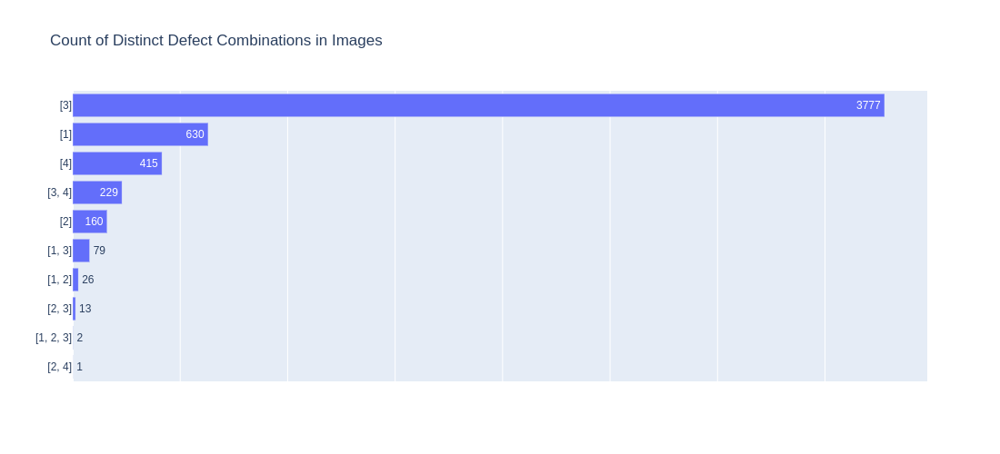
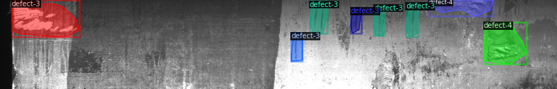
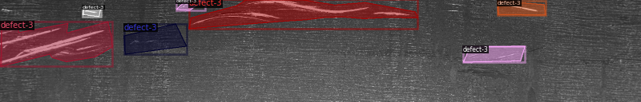
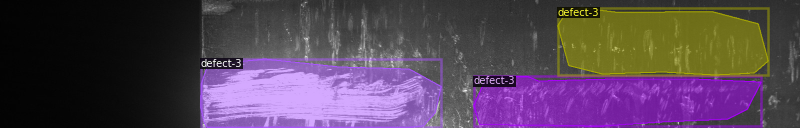
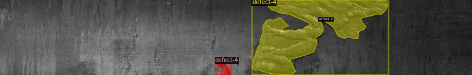
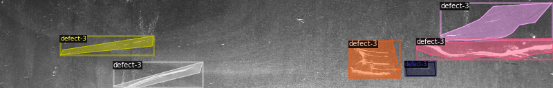

# severstal-steel-defect-detection-using-Detectron2-Pytorch
Severstal is leading the charge in efficient steel mining and production. They believe the future of metallurgy requires development across the economic, ecological, and social aspects of the industry—and they take corporate responsibility seriously. The company recently created the country’s largest industrial data lake, with petabytes of data that were previously discarded. Severstal is now looking to machine learning to improve automation, increase efficiency, and maintain high quality in their production.  The production process of flat sheet steel is especially delicate. From heating and rolling, to drying and cutting, several machines touch flat steel by the time it’s ready to ship. Today, Severstal uses images from high frequency cameras to power a defect detection algorithm.
<br>
#convert RLE to Detectron2 Format<br>
https://github.com/panditrahulsharma/RLE-to-polygon-format/edit/master/README.md<br>

#install Detectron2<br>
https://gilberttanner.com/blog/detectron-2-object-detection-with-pytorch<br>

#use Model
https://detectron2.readthedocs.io/tutorials/models.html

<br><br>

Segmentation Steel images<br><br>

<br><br>
<br><br>
<br><br>
<br><br>
<br><br>

```
Folder Structure
├── Steel
│   ├── train
│   │       └── .jpg images (7000 items)
|   |       |
|   |       |___data.csv
|   |
│   └── val
│   |   └── .jpg (3000 items)
|   |   |__data.csv
    |
    |____.rle_to_contour.ipynb 
    |
    |___Detectron2_for_Steel_Defect_Detection.py  
    #Script that Convert RLE ro Detectron2 Format


